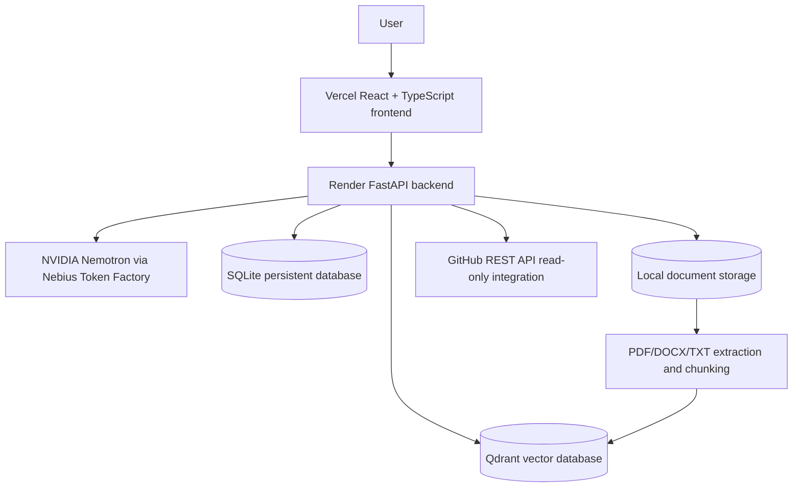
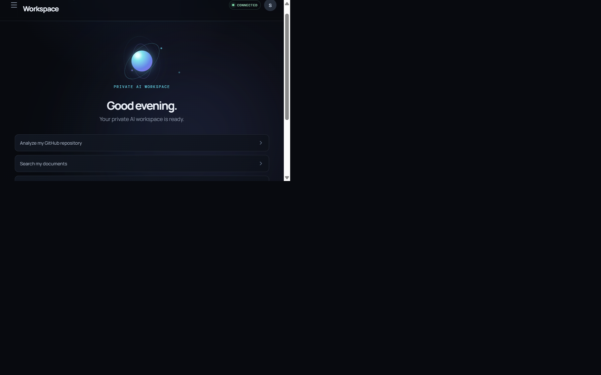

# 🔐 Private AI Workmate

> Your private AI workmate for memory, documents, tools, and developer workflows.

[](backend/requirements.txt)
[](backend/app/main.py)
[](frontend/src/App.tsx)
[](backend/app/nemotron.py)
[](https://nebius.ai/)
[](backend/app/memory/qdrant.py)

Private AI Workmate is a personal AI workspace powered by NVIDIA Nemotron through Nebius Token Factory. It combines persistent conversations, semantic memory, private document retrieval, controlled tools, and a read-only GitHub developer agent in one application.

## 🚀 Live Demo

**Public demo:** https://private-ai-workmate.vercel.app/

The demo opens directly in the Workmate interface. When no session exists, the backend creates an isolated anonymous demo workspace and protects it with the same authenticated ownership checks used by the rest of the API.

## 🧠 What is Private AI Workmate?

Generic AI assistants often require users to repeatedly provide context and may not provide controlled access to personal documents, memory, developer information, and tools.

Private AI Workmate is designed around persistent memory, private document RAG, controlled tools, and developer workflows. Conversations and user-owned data are scoped through backend sessions; document content and memory are retrieved as context, while model-requested tools pass through validation, permissions, security scanning, and audit logging.

## 🎯 Hackathon Track

**Nebius x NVIDIA Global AI Hackathon 2026**

**Personal AI Track**

The project fits the track through:

- persistent long-term memory and semantic retrieval
- private, user-scoped document knowledge
- reusable backend tools with explicit permissions
- controlled access to information and developer workflows
- read-only GitHub repository analysis
- bounded multi-step agent workflows
- NVIDIA Nemotron inference through Nebius Token Factory

## 🏗️ Architecture



The repository currently uses SQLite, local document storage, and local Qdrant paths configured for the Render persistent disk. Supabase is not configured in the current implementation.

## 🤖 AI / NVIDIA / Nebius

NVIDIA Nemotron is the core LLM. Nebius Token Factory provides the OpenAI-compatible runtime inference API used by the backend for chat, agent synthesis, and embeddings.

| Component | Current configuration | Role |
|---|---|---|
| Fast model | `nvidia/NVIDIA-Nemotron-3-Nano-30B-A3B` | Configured fast/default model for everyday responses and fallback behavior |
| Reasoning model | `nvidia/Nemotron-3-Ultra-550b-a55b` | Configured model used by the current agent path for tool collection and final synthesis |
| Embeddings | `Qwen/Qwen3-Embedding-8B` | Embeds memory and document chunks for semantic retrieval through Nebius |
| Runtime | Nebius Token Factory | Serves the configured NVIDIA/Qwen models through the backend |

`model_router.py` contains deterministic fast/reasoning classification, but `select_model()` is not actively wired into each public request. The current agent path uses the configured reasoning model for tool collection and final synthesis, with the fast model available as a fallback.

Nebius matters because it supplies the hosted inference path that lets this application use Nemotron and the embedding model without placing provider credentials in the browser.

## ✨ Core Features

### Persistent Memory

Long-term memories can be stored, listed, and deleted through the memory API. Relevant memories are semantically retrieved before chat responses and passed as context rather than instructions.

### Private Document RAG

`PDF/DOCX/TXT → extraction → chunking → embeddings → Qdrant → grounded answers`

Uploads are limited to 10 MB. Document metadata and chunk counts are stored in SQLite, while retrieved document chunks are filtered by similarity and scoped to the authenticated user.

### Agentic Tools

The registered tools include:

- calculator
- current time
- document listing, search, and reading
- GitHub repository inspection

### GitHub Developer Agent

The current GitHub integration is read-only. It supports repository information, file trees, file reading, code search, issues, pull requests, and bounded multi-step repository analysis. It does not write to repositories, create commits, merge pull requests, or run GitHub Actions.

### Security

Implemented controls include:

- permission-gated tool execution
- read-only GitHub access
- prompt-injection detection
- untrusted-data boundaries for memory, documents, and tool results
- secret redaction in audit data
- JSONL audit logging
- no arbitrary shell or Python execution through model tools
- user-scoped conversations, memory, and documents
- HttpOnly session cookies, including isolated public demo sessions

These controls describe the implemented application boundary; they are not a claim that cloud services or external content are risk-free.

## 🛠️ Technology Stack

| Area | Technologies |
|---|---|
| Frontend | React, TypeScript, Vite, Lucide React |
| Backend | Python, FastAPI, Uvicorn |
| AI | NVIDIA Nemotron, Nebius Token Factory, Qwen/Qwen3-Embedding-8B |
| Storage | SQLite, local document storage, Qdrant |
| Document processing | PyPDF, python-docx |
| Developer integration | GitHub REST API via `httpx` |
| Deployment | Vercel, Render persistent disk, Nebius Token Factory |

## 🔐 Security & Privacy Model

```text
User → React frontend → authenticated FastAPI session → controlled model/tool layer
```

Chat requests go from the browser to the backend, which retrieves user-scoped context and calls Nebius. Uploaded documents are stored by the backend, extracted and embedded, and indexed in Qdrant. Memory records are stored in SQLite and their embeddings are indexed for semantic retrieval. GitHub access is performed server-side through approved read-only operations.

The deployed application is cloud-hosted, so “private” means access is mediated by backend sessions, ownership filters, controlled tools, and configured cloud-service boundaries. It does not mean that all data is processed locally. Secrets such as `NEBIUS_API_KEY` and `GITHUB_TOKEN` are backend environment variables and are never part of the frontend bundle.

## ☁️ Deployment

- **Vercel:** React/Vite frontend
- **Render:** FastAPI backend and persistent application data disk
- **Qdrant:** vector storage using the configured Qdrant path
- **Nebius Token Factory:** Nemotron and embedding inference

Environment variable names used by deployment configuration include:

```text
NEBIUS_API_KEY
GITHUB_TOKEN
NEBIUS_FAST_MODEL
NEBIUS_REASONING_MODEL
WORKMATE_TOOL_MODE
WORKMATE_COOKIE_SECURE
WORKMATE_COOKIE_SAMESITE
WORKMATE_DATA_DIR
WORKMATE_DATABASE_PATH
WORKMATE_QDRANT_PATH
WORKMATE_DOCUMENTS_PATH
WORKMATE_AUDIT_FILE
CORS_ORIGINS
VITE_API_BASE_URL
```

No secret values belong in this README, frontend source, or committed configuration.

## 💻 Local Development

Clone the repository and install the backend dependencies:

```powershell
git clone https://github.com/saad07072/private-ai-workmate.git
cd private-ai-workmate
python -m venv .venv
.venv\Scripts\Activate.ps1
pip install -r backend/requirements.txt
```

Create `backend/.env` from `backend/.env.example` and set `NEBIUS_API_KEY`. `GITHUB_TOKEN` is optional for public repository access. Keep `WORKMATE_TOOL_MODE=read_only` during development.

Start the backend:

```powershell
cd backend
python -m uvicorn app.main:app --reload
```

In a second terminal, start the frontend:

```powershell
cd frontend
npm install
npm run dev
```

Open `http://127.0.0.1:5173/`. Vite proxies `/api` and `/health` to `http://127.0.0.1:8000`.

Docker Compose is also supported when Docker is installed and `backend/.env` is configured:

```powershell
docker compose up --build
```

## 🧪 Validation

The repository supports these checks and validation surfaces:

- backend `GET /health` health check
- frontend TypeScript check and production build via `npm run build`
- security tests in `tests/test_security.py`
- semantic memory retrieval script in `backend/app/memory/test_semantic.py`
- Nebius connectivity check in `backend/app/check_nebius.py`
- document/RAG retrieval through the Documents and Chat APIs
- GitHub agent read-only tools through the chat-backed agent path
- prompt-injection and permission checks in the backend security layer
- Docker healthcheck and Compose validation through `docker compose up --build`

## 📊 Hackathon Requirements Checklist

Based on the current [official hackathon requirements](https://nebiusglobalaihackathon.devpost.com/):

- [x] Working software application
- [x] Runs using Nebius Token Factory
- [x] Uses an NVIDIA open-source model / Nemotron
- [x] Personal AI track
- [x] Public working demo
- [x] Public source repository: https://github.com/saad07072/private-ai-workmate
- [x] README with setup instructions
- [x] README explains NVIDIA/Nemotron and Nebius usage
- [ ] Public demonstration video under 3 minutes
- [ ] Final Devpost submission
- [ ] Feedback on Nebius/NVIDIA technologies
- [ ] Open-source license visible in the public repository

The official submission requires a working project, a working demo URL, a public code repository with setup guidance, and a public video of three minutes or less. Review the [official rules](https://nebiusglobalaihackathon.devpost.com/rules) before submitting.

## 🏆 Why This Project Fits Personal AI

Private AI Workmate brings together persistent personal context, private document knowledge, controlled tools, developer workflows, and cloud-hosted Nemotron inference. Its focus is a personal workspace that can remember useful context, work over a user’s documents, inspect code through approved read-only operations, and keep the model inside a deliberately bounded backend tool layer.

## 🎥 Demo Flow

1. Open the live application.
2. Show the main Private AI Workmate interface.
3. Ask a normal question.
4. Demonstrate persistent memory.
5. Ask a question about an uploaded document.
6. Demonstrate GitHub repository analysis.
7. Show Security Center and the tool boundary.
8. Briefly show the architecture and Nebius/Nemotron integration.

## 📸 Product UI



## 📚 Hackathon References

- [Nebius x NVIDIA Global AI Hackathon](https://nebiusglobalaihackathon.devpost.com/)
- [Official rules](https://nebiusglobalaihackathon.devpost.com/rules)
- [Public repository](https://github.com/saad07072/private-ai-workmate)
