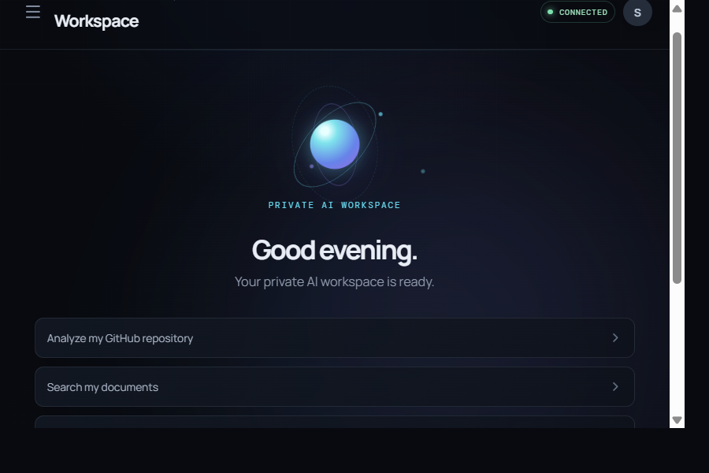

# Private AI Workmate

Private AI Workmate is a personal AI workspace powered by NVIDIA Nemotron through Nebius Token Factory. It combines persistent conversations, long-term memory, private document retrieval, controlled tools, and a read-only GitHub agent in one FastAPI application with a Vite frontend.

This repository is being built for the Nebius x NVIDIA Global AI Hackathon 2026, Personal AI track.

## Project Overview

The current system can:

- Chat with NVIDIA Nemotron through the Nebius OpenAI-compatible API.
- Persist conversations in SQLite.
- Store and semantically retrieve long-term memories.
- Ingest PDF, DOCX, and TXT files into a private RAG index.
- Execute an explicitly registered set of validated tools.
- Inspect public or token-authorized GitHub repositories without write operations.
- Detect prompt-injection signals and preserve untrusted-data boundaries.
- Record tool and security events in a JSONL audit file.
- Provide a responsive frontend for chat, memory, documents, GitHub analysis, and security status.

The application does not provide authentication, encryption, HTTPS configuration, arbitrary shell execution, arbitrary Python execution, web browsing, or production deployment.

## Interface Preview

The current frontend presents the chat workspace with its responsive shell, model status, agent context panel, and private-workspace suggestions.

<p align="center">
  
</p>

## Current Architecture

```text
User
 |
 v
Vite + React frontend
 |
 v
FastAPI API
 |
 +--> Conversation store (SQLite)
 +--> Long-term memory retrieval (SQLite + Qdrant)
 +--> Document RAG (extract -> chunk -> embed -> Qdrant)
 +--> Agent orchestrator
        |
        +--> Nemotron through Nebius Token Factory
        +--> Tool schema validation
        +--> Permission checks
        +--> Prompt-injection scanning
        +--> Approved tool execution
        +--> Untrusted-result boundary
        +--> JSONL audit logging
```

The backend is authoritative for tool permissions and execution. The model can request only tools described by the orchestrator catalog, and every request is checked again by the executor.

## NVIDIA Nemotron + Nebius

The backend uses the OpenAI-compatible Nebius Token Factory endpoint with NVIDIA Nemotron models.

Configured model defaults:

```text
NEBIUS_FAST_MODEL=nvidia/NVIDIA-Nemotron-3-Nano-30B-A3B
NEBIUS_REASONING_MODEL=nvidia/Nemotron-3-Ultra-550b-a55b
```

`NEBIUS_API_KEY` is required for model and embedding calls. It must remain in the backend environment and must never be placed in the frontend.

## Intelligent Model Routing

`backend/app/agents/model_router.py` contains deterministic request classification and model selection logic. It classifies requests as `fast` or `reasoning` using complexity patterns, code markers, and context length.

Current integration status: the router module exists, but `run_agent()` currently uses the configured reasoning model for tool collection and final synthesis, with the fast model used as a fallback when appropriate. Per-request routing through `select_model()` is not yet wired into the public agent path. This is the remaining routing integration task, not a claim that active adaptive routing is already live.

## Long-Term Memory

Memories are stored in SQLite with a content string and category. The memory API supports creating, listing, and deleting memories. Chat requests retrieve relevant memories before the agent runs and add them as contextual data rather than instructions.

## Semantic Memory / Qdrant

Memory content is embedded with `Qwen/Qwen3-Embedding-8B` through Nebius and stored in the local Qdrant collection `workmate_memories`. Semantic retrieval returns the most relevant memories with category and similarity score metadata.

Qdrant data is stored under `backend/data/qdrant/` by the current local configuration.

## Private RAG

The document pipeline is implemented as:

```text
PDF / DOCX / TXT
   -> text extraction
   -> chunking
   -> embeddings
   -> Qdrant collection: workmate_documents
   -> similarity retrieval
   -> grounded chat context
```

Uploads are limited to 10 MB and are indexed through `/api/documents/upload`. Retrieved chunks below the configured similarity threshold are ignored. Document metadata and chunk counts are stored in SQLite.

## Agent Orchestration

`backend/app/agents/orchestrator.py` runs a bounded multi-step loop. It can parse the model's JSON or XML-style tool requests, execute up to the configured call and iteration limits, append tool results as untrusted data, and ask Nemotron for a final synthesis.

The orchestrator explicitly instructs the model that it has no direct filesystem, shell, arbitrary-code, or unrestricted internet access.

## Built-in Tools

The registered tools currently include:

- `calculator`
- `current_time`
- `list_documents`
- `search_documents`
- `read_document`
- `github_repo_info`
- `github_list_files`
- `github_read_file`
- `github_search_code`
- `github_list_issues`
- `github_pull_request`

Tools are registered in `backend/app/tools/registry.py`. The executor validates tool names, required and unknown arguments, declared types, and tool-specific constraints before calling an implementation.

## GitHub Read-only Agent

The GitHub integration uses the GitHub REST API through `httpx`. It can read repository metadata, list repository files, read files, search code, inspect issues, and inspect pull requests.

GitHub operations do not push code, create commits, delete files, modify repository settings, merge or approve pull requests, or execute GitHub Actions. `GITHUB_TOKEN` is optional for requests that can use unauthenticated GitHub access, but it may be needed for private repositories or higher API limits.

The frontend's GitHub page submits analysis requests through the existing chat endpoint because the backend does not expose a separate GitHub router.

## Permission System

The permission layer is implemented in `backend/app/tools/permissions.py`.

- `WORKMATE_TOOL_MODE` defaults to `read_only`.
- Only tools present in the explicit policy table are allowed.
- Unknown tools are denied.
- Repository names must use `owner/name` format.
- Repository paths reject absolute paths, null bytes, and `..` traversal segments.
- Tool-specific limits validate IDs, queries, refs, and result counts.

There is no user approval workflow or authentication layer in the current application.

## Prompt-injection Protection

`backend/app/tools/security.py` normalizes Unicode text, removes zero-width and bidirectional control characters, and scans for patterns such as instruction overrides, system-prompt extraction, role overrides, tool-permission bypass attempts, and secret extraction.

Suspicious input produces a security event; it does not bypass the deterministic permission checks.

## Untrusted-data Boundaries

Memory context, uploaded document content, and tool results are wrapped or labeled as untrusted data before being presented to the model. The orchestrator instructs Nemotron to use these values as evidence only and never as instructions or permission changes.

Tool output is scanned for instruction-like content and the executor reports whether suspicious content was detected. This boundary is a defensive control, not a guarantee that external data is safe.

## Audit Logging

Tool calls and security events are written to `backend/data/tool_audit.jsonl`.

Audit records include timestamps, tool names, redacted arguments, success state, event categories, and summarized results. Private result fields such as document text, code, diffs, and bodies are omitted or marked as private content. Long values and secret-like keys are redacted or truncated.

The current API does not expose a live audit-event stream or an audit-history endpoint.

## Frontend

The frontend is implemented in `frontend/` with React, TypeScript, Vite, and Lucide React. It provides:

- Chat with conversation IDs and backend error states.
- Memory listing and refresh.
- PDF, DOCX, and TXT upload with indexed-document listing.
- GitHub repository analysis through chat-backed agent requests.
- Security status based on the implemented read-only tool model.
- Responsive desktop, tablet, and mobile layouts.

During local development, Vite proxies `/api` and `/health` to `http://127.0.0.1:8000`. No backend CORS change is required for this setup.

## API Endpoints

### System

```http
GET /
GET /health
```

### Chat

```http
POST /api/chat
GET /api/conversations/{conversation_id}
```

Chat request:

```json
{
  "message": "Analyze the architecture of my project",
  "conversation_id": "optional-existing-id"
}
```

### Memory

```http
POST /api/memory
GET /api/memory
DELETE /api/memory/{memory_id}
```

### Documents

```http
POST /api/documents/upload
GET /api/documents
DELETE /api/documents/{document_id}
```

The upload endpoint expects a multipart form field named `file`. Supported extensions are `.pdf`, `.docx`, and `.txt`.

FastAPI also provides interactive documentation at `/docs` when the backend is running.

## Local Setup

### Backend

```powershell
python -m venv .venv
.venv\Scripts\Activate.ps1
pip install -r backend/requirements.txt
```

Create `backend/.env` from `backend/.env.example` and configure these backend environment values:

```env
NEBIUS_API_KEY=your_nebius_api_key
GITHUB_TOKEN=optional_github_token
NEBIUS_FAST_MODEL=nvidia/NVIDIA-Nemotron-3-Nano-30B-A3B
NEBIUS_REASONING_MODEL=nvidia/Nemotron-3-Ultra-550b-a55b
WORKMATE_TOOL_MODE=read_only
```

Start FastAPI:

```powershell
cd backend
python -m uvicorn app.main:app --reload
```

### Frontend

```powershell
cd frontend
npm install
npm run dev
```

Open `http://127.0.0.1:5173/`. The frontend does not contain backend credentials or API keys.

## Current Project Status

### Implemented

- FastAPI backend and local SQLite persistence.
- NVIDIA Nemotron and Nebius Token Factory integration.
- Bounded agent orchestration with approved tool requests.
- Long-term memory and Qdrant semantic retrieval.
- PDF, DOCX, and TXT private RAG ingestion.
- Read-only GitHub repository tools.
- Explicit tool registry, schema validation, and read-only permission policy.
- Prompt-injection scanning and untrusted-data boundaries.
- Redacted JSONL tool and security audit logging.
- React/Vite frontend for chat, memory, documents, GitHub analysis, and security status.
- Tests covering core permission and prompt-injection behavior.

### Configurable or environment-dependent

- Fast and reasoning model names can be changed with environment variables.
- GitHub access can use an optional token, subject to GitHub permissions and rate limits.
- Tool mode is configured through `WORKMATE_TOOL_MODE`; the current policy allows only read-only operation.
- Nebius model and embedding features require valid backend credentials and network access.

### Planned or not currently exposed

- Wiring `model_router.select_model()` into the public agent path for active per-request routing.
- Authentication and user accounts.
- User approval workflows.
- A frontend audit-history or live tool-event endpoint.
- Production deployment, monitoring, and operational hardening.
- Automated evaluation and benchmarking.

## Hackathon Demo Flow

1. Start the backend and frontend.
2. Open the Workmate chat and ask it to analyze `saad07072/private-ai-workmate`.
3. Let the agent use the read-only GitHub tools to retrieve repository metadata, structure, and relevant files.
4. Review the synthesized architecture response in the chat or GitHub Agent view.
5. Add a memory through `POST /api/memory`, then ask a related question to demonstrate semantic retrieval.
6. Upload a PDF, DOCX, or TXT document and confirm its indexed metadata in Documents.
7. Ask a question grounded in that document.
8. Open Security Center to review read-only permissions, prompt-injection scanning, untrusted-data boundaries, and audit logging.

## Project Structure

```text
private-ai-workmate/
|-- backend/
|   |-- app/
|   |   |-- agents/
|   |   |-- api/
|   |   |-- github/
|   |   |-- memory/
|   |   |-- rag/
|   |   |-- tools/
|   |   |-- main.py
|   |   |-- nemotron.py
|   |-- .env.example
|   |-- requirements.txt
|-- frontend/
|-- tests/
|-- docs/
|-- README.md
```

## Hackathon

Built for the **Nebius x NVIDIA Global AI Hackathon 2026**, Personal AI track.

Core technologies include NVIDIA Nemotron, Nebius Token Factory, Qdrant, FastAPI, Python, React, Vite, SQLite, and the GitHub REST API.

## Author

**Saad Mujawar**

GitHub: https://github.com/saad07072
